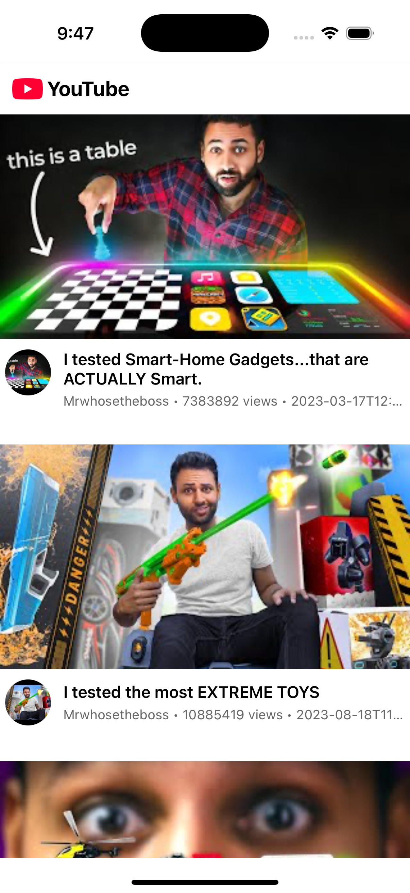
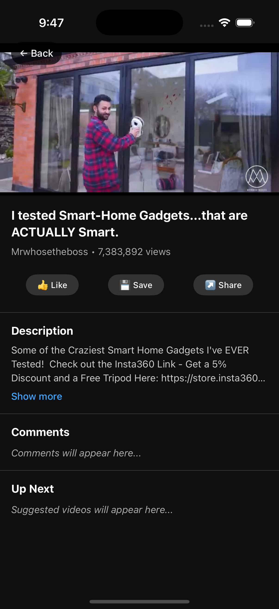

# YouTube Mobile App 📱

A full-stack mobile application for browsing and viewing YouTube videos, built with React Native frontend and Express.js backend.

  


## 🌟 Features

### 📱 Mobile App (React Native)

- **Video Browsing**: Browse YouTube videos with thumbnails and metadata
- **Video Player**: Integrated YouTube player with fullscreen support
- **Pull-to-Refresh**: Refresh video content with gesture
- **Responsive Design**: Optimized for iOS and Android
- **Dark Theme**: YouTube-inspired dark interface
- **Splash Screen**: Branded loading screen

### 🔧 Backend Server (Express.js)

- **RESTful API**: Clean API endpoints for video management
- **MongoDB Integration**: Persistent storage for video data
- **Health Monitoring**: Server health check endpoint
- **CORS Support**: Cross-origin resource sharing enabled
- **Error Handling**: Comprehensive error management

## 🏗️ Tech Stack

| Component       | Technology                     |
| --------------- | ------------------------------ |
| **Frontend**    | React Native, React Navigation |
| **Backend**     | Node.js                        |
| **Database**    | MongoDB                        |
| **API**         | YouTube Data API v3            |
| **Development** | Metro Bundler, Nodemon         |

## 📂 Project Structure

```
youtube-mobile-app/
├── 📱 mobile-app/               # React Native Frontend
│   ├── src/
│   │   ├── components/          # Reusable UI components
│   │   ├── screens/             # App screens
│   │   ├── navigation/          # Navigation setup
│   │   ├── services/            # API integration
│   │   └── assets/              # Images, fonts, icons
│   ├── App.js                   # Main app component
│   └── package.json
│
├── 🔧 server/                   # Express.js Backend
│   ├── index.js                 # Main server file
│   ├── package.json
│   └── .env.example             # Environment variables
│
└── 📖 README.md                 # You are here!
```

## 🚀 Quick Start

### Prerequisites

- **Node.js** (v16 or higher)
- **MongoDB** (local or Atlas)
- **React Native CLI**
- **Xcode** (for iOS)
- **Android Studio** (for Android)

### 1️⃣ Clone Repository

```bash
git clone https://github.com/Bishaltureha/youtubeclone.git
cd youtube-mobile-app
```

### 2️⃣ Backend Setup

```bash
# Navigate to server directory
cd server

# Install dependencies
npm install

# Create environment file
cp .env.example .env

# Start MongoDB (if local)
mongod

# Start server
npm run dev
```

### 3️⃣ Frontend Setup

```bash
# Navigate to mobile app
cd mobile-app

# Install dependencies
npm install

# iOS setup
cd ios && pod install && cd ..

# Start Metro bundler
npx react-native start

# Run on iOS
npx react-native run-ios

# Run on Android
npx react-native run-android
```

## ⚙️ Configuration

### Backend Environment Variables

Create `.env` file in server directory:

```env
# Server Configuration
PORT=3000

# Database
MONGODB_URI=mongodb://localhost:27017/youtube_db

# CORS (optional)
ALLOWED_ORIGINS=http://localhost:3000,http://localhost:19006
```

### Frontend Configuration

Create `client/.env`:

```javascript
API_KEY=<string>
BASE_URL=<string>
SERVER_URL=<string>
```

## 🔌 API Endpoints

### Get All Video IDs

```http
GET /api/youtube-ids
```

**Response:**

```json
{
  "success": true,
  "data": [
    {
      "_id": "64f5a1b2c3d4e5f6g7h8i9j0",
      "videoId": "dQw4w9WgXcQ"
    }
  ]
}
```

### Get Specific Video

```http
GET /api/youtube-ids/:id
```

### Health Check

```http
GET /health
```

## 🛠️ Development

### Backend Development

```bash
cd server

# Install dev dependencies
npm install -D nodemon

# Start server
npm run dev

# Run tests (if available)
npm test
```

### Frontend Development

```bash
cd mobile-app

# Start Metro with cache reset
npx react-native start --reset-cache

# Clean builds
npx react-native run-ios --clean
npx react-native run-android --clean
```

## 📦 Dependencies

### Backend

- **express**: Web framework
- **mongoose**: MongoDB ODM
- **cors**: CORS middleware
- **dotenv**: Environment variables

### Frontend

- **react-native**: Mobile framework
- **@react-navigation**: Navigation library
- **react-native-safe-area-context**: Safe area handling

## 🔧 Troubleshooting

### Common Issues

**🔴 MongoDB Connection Error**

```bash
# Check MongoDB status
sudo systemctl status mongod

# Start MongoDB
sudo systemctl start mongod
```

**🔴 Port Already in Use**

```bash
# Find process on port 3000
lsof -i :3000

# Kill process
kill -9 <PID>
```

**🔴 Metro Bundler Issues**

```bash
# Clear cache
npx react-native start --reset-cache

# Clean Android build
cd android && ./gradlew clean
```

**🔴 iOS Build Issues**

```bash
# Reinstall pods
cd ios && pod deintegrate && pod install
```

## 🚢 Deployment

### Backend (Production)

```bash
# Build for production
npm run build

# Start production server
npm start

# Using PM2
pm2 start server.js --name youtube-api
```

### Mobile App

#### iOS

```bash
# Build for App Store
xcodebuild -workspace ios/YourApp.xcworkspace \
  -configuration Release \
  -scheme YourApp \
  archive
```

#### Android

```bash
# Build APK
cd android && ./gradlew assembleRelease

# Build AAB for Play Store
cd android && ./gradlew bundleRelease
```

## 🔗 Links

- [React Native Documentation](https://reactnative.dev/docs/getting-started)
- [Express.js Guide](https://expressjs.com/en/guide/routing.html)
- [MongoDB Documentation](https://docs.mongodb.com/)
- [YouTube API Reference](https://developers.google.com/youtube/v3/docs)

---
